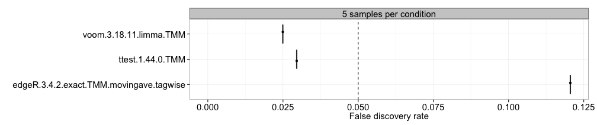
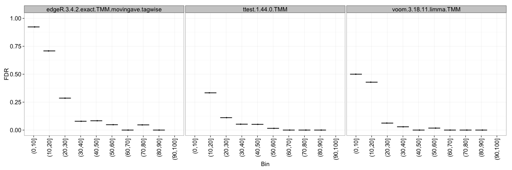
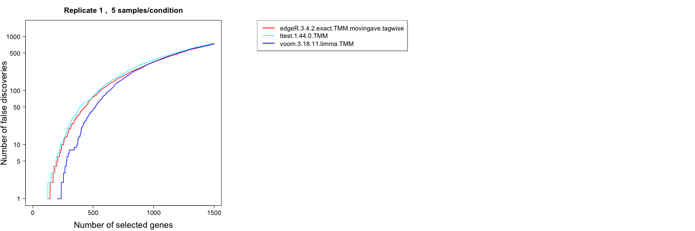
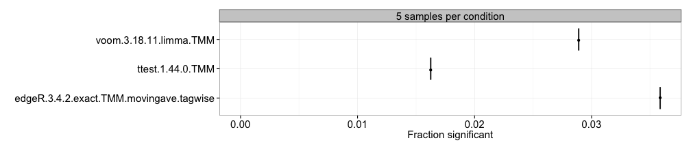
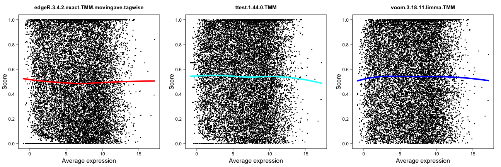

```{r, include = FALSE}
knitr::opts_chunk$set(
  collapse = TRUE,
  comment = "#>"
)
options(width = 55)
```

```{r setup}
library(compcodeR)
```

# Introduction

`r Biocpkg("compcodeR")` is an R package that provides an interface to several popular methods for differential expression analysis of RNAseq data and contains functionality for comparing the outcomes and performances of several differential expression methods applied to the same data set. The package also contains a function for generating synthetic RNAseq counts, using the simulation framework described in more detail in @Soneson2013.

This vignette provides a tutorial on how to use the different functionalities of the `r Biocpkg("compcodeR")` package. 

Currently, the differential expression interfaces provided in the package are restricted to comparisons between two conditions. However, many of the comparison functions are more general and can also be applied to test results from other contrast types, as well as to test results from other data types than RNAseq.

**Important!** Since `r Biocpkg("compcodeR")` provides interfaces to differential expression analysis methods implemented in other R packages, take care to cite the appropriate references if you use any of the interface functions (see the reference manual for more information). Also be sure to always check the code that was used to run the differential expression analysis, using e.g. the `generateCodeHTMLs()` function (see [below](#performing-differential-expression-analysis) for more information) to make sure that parameters etc. agree with your intentions and that there were no errors or serious warnings. These interface functions are provided for convenience and as templates for other, user-defined workflows, and there is no guarantee that the included differential expression code is kept up-to-date with the latest recommendations and best practices for running each of the interfaced methods, or that the chosen settings are suitable in all situations, and the user should make sure that the analysis is performed in the way they intend. For instructions on how to add your own DE method, see [below](#providing-your-own-differential-expression-code).


# The `compData` class

Within the `r Biocpkg("compcodeR")` package (version >= 0.2.0), data sets and results are represented as objects of the `compData` class. The functions in the package are still compatible with the list-based representation used in version 0.1.0, but we strongly encourage users to use the `compData` class, and all results generated by the package will be given in this format. If you have a data or result object generated with `r Biocpkg("compcodeR")` version 0.1.0, you can convert it to a `compData` object using the `convertListTocompData` function. 

A `compData` object has at least three slots, containing the count matrix, sample annotations and a list containing at least an identifying name and a unique ID for the data set. It can also contain variable annotations, such as information regarding genes that are known to be differentially expressed. After performing a differential expression analysis, the `compData` object contains additional information, such as which method was used to perform the analysis, which settings were used and the gene-wise results from the analysis. More detailed information about the `compData` class are available in the sections on [the data object](#the-data-object) and [the result object](#the-result-object).

# A sample workflow
This section contains a sample workflow showing the main functionalities of the `r Biocpkg("compcodeR")` package. We start by [generating a synthetic count data set](#simulating-data), to which we then [apply three different differential expression methods](#performing-differential-expression-analysis). Finally, we [compare the outcome](#comparing-results-from-several-differential-expression-methods) of the three methods and generate a report summarizing the results.

## Simulating data
The simulations are performed following the description by @Soneson2013. As an example, we use the `generateSyntheticData` function to generate a synthetic count data set containing 12,500 genes and two groups of 5 samples each, where 10% of the genes are simulated to be differentially expressed between the two groups (equally distributed between up- and downregulated in group 2 compared to group 1). Furthermore, the counts for all genes are simulated from a Negative Binomial distribution with the same dispersion in the two sample groups, and no outlier counts are introduced. We filter the data set by excluding only the genes with zero counts in all samples (i.e., those for which the total count is 0). This simulation setting corresponds to the one denoted $B_{625}^{625}$ in @Soneson2013. The following code creates a `compData` object containing the simulated data set and saves it to a file named `"B_625_625_5spc_repl1.rds"`.

```{r, eval=FALSE}
B_625_625 <- generateSyntheticData(dataset = "B_625_625", n.vars = 12500, 
                                   samples.per.cond = 5, n.diffexp = 1250, 
                                   repl.id = 1, seqdepth = 1e7, 
                                   fraction.upregulated = 0.5, 
                                   between.group.diffdisp = FALSE, 
                                   filter.threshold.total = 1, 
                                   filter.threshold.mediancpm = 0, 
                                   fraction.non.overdispersed = 0, 
                                   output.file = "B_625_625_5spc_repl1.rds")
```

The `summarizeSyntheticDataSet` function provides functionality to check some aspects of the simulated data by generating a report summarizing the parameters that were used for the simulation, as well as including some diagnostic plots. The report contains two MA-plots, showing the estimated average expression level and the log-fold change for all genes, indicating either the truly differentially expressed genes or the total number of outliers introduced for each gene. It also shows the log-fold changes estimated from the simulated data versus those underlying the simulation. The input to the `summarizeSyntheticDataSet` function can be either a `compData` object or the path to a file containing such an object. 

```{r reportsimulated, eval = FALSE}
summarizeSyntheticDataSet(data.set = "B_625_625_5spc_repl1.rds", 
                          output.filename = "B_625_625_5spc_repl1_datacheck.html")
```

Figure 1 shows two of the figures generated by this function. The top panel shows an MA plot with the genes colored by the true differential expression status. The bottom panel shows the relationship between the true log-fold changes between the two sample groups underlying the simulation, and the estimated log-fold changes based on the simulated counts. 

```{r, echo = FALSE, fig.cap = "Example figures from the summarization report generated for a simulated data set. The top panel shows an MA plot, with the genes colored by the true differential expression status. The bottom panel shows the relationship between the true log-fold changes between the two sample groups underlying the simulation, and the estimated log-fold changes based on the simulated counts. Also here, the genes are colored by the true differential expression status.", fig.show='hold',fig.align='center'}
knitr::include_graphics(c("compcodeR_check_figure/maplot-trueDEstatus.png", "compcodeR_check_figure/logfoldchanges.png"))
```

## Performing differential expression analysis 
We will now apply some of the interfaced differential expression methods to find genes that are differentially expressed between the two conditions in the simulated data set. This is done through the `runDiffExp` function, which is the main interface for performing differential expression analyses in `r Biocpkg("compcodeR")`. The code below applies three differential expression methods to the data set generated above: the `voom` transformation from the `r Biocpkg("limma")` package (combined with `limma` for differential expression), the exact test from the `r Biocpkg("edgeR")` package, and a regular t-test applied directly on the count level data. 

```{r rundiffexp1, eval = FALSE}
runDiffExp(data.file = "B_625_625_5spc_repl1.rds", 
           result.extent = "voom.limma", Rmdfunction = "voom.limma.createRmd", 
           output.directory = ".", norm.method = "TMM")
runDiffExp(data.file = "B_625_625_5spc_repl1.rds", 
           result.extent = "edgeR.exact", Rmdfunction = "edgeR.exact.createRmd", 
           output.directory = ".", norm.method = "TMM", 
           trend.method = "movingave", disp.type = "tagwise")
runDiffExp(data.file = "B_625_625_5spc_repl1.rds", result.extent = "ttest", 
           Rmdfunction = "ttest.createRmd", 
           output.directory = ".", norm.method = "TMM")
```

The code needed to perform each of the analyses is provided in the `*.createRmd` functions. To obtain a list of all available `*.createRmd` functions (and hence of the available differential expression methods), we can use the `listcreateRmd()` function. Example calls are also provided in the reference manual (see the help pages for the `runDiffExp` function).

```{r listcreatermd}
listcreateRmd()
```

You can also [apply your own differential expression method](#providing-your-own-differential-expression-code) to the simulated data.

## Comparing results from several differential expression methods

Once we have obtained the results of the differential expression analyses (either by the methods interfaced by `r Biocpkg("compcodeR")` or in other ways), we can compare the results and generate an HTML report summarizing the results from the different methods from many different aspects (see below for an [overview of the comparison metrics](#the-evaluation-metrics)). In `r Biocpkg("compcodeR")`, there are two ways of invoking the comparison functionality; either directly from the command line or via a graphical user interface (GUI). The GUI is mainly included to avoid long function calls and provide a clear overview of the available methods and parameter choices. To use the GUI the R package `r CRANpkg("rpanel")` must be installed (which assumes that BWidget is available). Moreover, the GUI may have rendering problems on certain platforms, particularly on small screens and if many methods are to be compared. Below, we will show how to perform the comparison using both approaches.

### The graphical user interface

First, we consider the `runComparisonGUI` function, to which we provide a list of directories containing our result files, and the directory where the final report will be generated. Since the three result files above were saved in the current working directory, we can run the following code to perform the comparison:

```{r runcomparison, eval = FALSE}
runComparisonGUI(input.directories = ".", 
                 output.directory = ".", recursive = FALSE)
```

This opens a graphical user interface (Figure 2) where we can select which of the data files available in the input directories that should be included as a basis for the comparison, and which comparisons to perform. Through this interface, we can also set p-value cutoffs for significance and other parameters that will govern the behaviour of the comparison. 

**Important!** When you have modified a value in one of the textboxes (p-value cutoffs etc.), press Return on your keyboard to confirm the assignment of the new value to the parameter. Always check in the resulting comparison report that the correct values were recognized and used for the comparisons.

```{r, echo = FALSE, fig.cap = "Screenshot of the graphical user interface used to select data set (left) and set parameters (right) for the comparison of differential expression methods. The available choices for the Data set, DE methods, Number of samples and Replicates are automatically generated from the compData objects available in the designated input directories. Only one data set can be used for the comparison. In the lower part of the window we can set (adjusted) p-value thresholds for each comparison method separately. For example, we can evaluate the true FDR at one adjusted p-value threshold, and estimate the TPR for another adjusted p-value threshold. We can also set the maximal number of top-ranked variables that will be considered for the false discovery curves.", fig.show='hold',fig.align='center'}
knitr::include_graphics(c("screenshot-gui-1.png", "screenshot-gui-2.png"))
```

After the selections have been made, the function will perform the comparisons and generate an HTML report, which is saved in the designated output directory and automatically named `compcodeR_report_<timestamp>.html`. Please note that depending on the number of compared methods and the number of included data sets, this step may take several minutes. `r Biocpkg("compcodeR")` will notify you when the report is ready (with a message **Done!** in the console). 

**Note!** Depending on the platform you use to run R, you may see a prompt ($">"$) in the console before the analysis is done. However, `r Biocpkg("compcodeR")` will always notify you when it is finished, by typing **Done!** in the console.

The comparison function will also generate a subdirectory called `compcodeR_code`, where the R code used to perform each of the comparisons is detailed in HTML reports, and another subdirectory called `compcodeR_figure`, where the plots generated in the comparison are saved. The code HTML reports can also be generated manually for a given result file (given that the `code` component is present in the `compData` object), using the function `generateCodeHTMLs`. For example, to generate a report containing the code that was run to perform the t-test above, as well as the output from the R console, we can write:

```{r generatecode, eval = FALSE}
generateCodeHTMLs("B_625_625_5spc_repl1_ttest.rds", ".")
```

These reports are useful to check that there were no errors or warnings when running the differential expression analyses. 

### Direct command-line call

Next, we show how to run the comparison by calling the function `runComparison` directly. In this case, we need to supply the function with a list of result files to use as a basis for the comparison. We can also provide a list of parameters (p-value thresholds, the differential expression methods to include in the comparison, etc.). The default values of these parameters are outlined in the reference manual. The following code provides an example, given the data generated above.

```{r nogui-comparison, eval = FALSE}
file.table <- data.frame(input.files = c("B_625_625_5spc_repl1_voom.limma.rds", 
                                         "B_625_625_5spc_repl1_ttest.rds", 
                                         "B_625_625_5spc_repl1_edgeR.exact.rds"), 
                         stringsAsFactors = FALSE)
parameters <- list(incl.nbr.samples = NULL, incl.replicates = NULL, 
                   incl.dataset = "B_625_625", incl.de.methods = NULL, 
                   fdr.threshold = 0.05, tpr.threshold = 0.05, 
                   typeI.threshold = 0.05, ma.threshold = 0.05, 
                   fdc.maxvar = 1500, overlap.threshold = 0.05, 
                   fracsign.threshold = 0.05, 
                   comparisons = c("auc", "fdr", "tpr", "ma", "correlation"))
runComparison(file.table = file.table, parameters = parameters, output.directory = ".")
```

By setting `incl.nbr.samples`, `incl.replicates` and `incl.de.methods` to `NULL`, we ask `r Biocpkg("compcodeR")` to include all results provided in the `file.table`. By providing a vector of values for each of these variables, it is possible to limit the selection to a subset of the provided files. Please note that the values given to `incl.replicates` and `incl.nbr.samples` are matched with values of the `info.parameters$repl.id` and `info.parameters$samples.per.cond` slots in the data/result objects, and that the values given to `incl.de.methods` are matched with values stored in the `method.names$full.name` slot of the result objects. If the values do not match, the corresponding result object will not be considered in the comparison. Consult the package manual for the full list of comparison methods available for use with the `runComparison` function. Setting `parameters = NULL` implies that all results provided in the `file.table` are used, and that all parameter values are set to their defaults (see the reference manual). Note that only one dataset identifier can be provided to the comparison (that is, `parameters$incl.dataset` must be a single string).


# Using your own data

The `r Biocpkg("compcodeR")` package provides a straightforward function for simulating count data (`generateSyntheticData`). However, it is easy to apply the interfaced differential expression methods to your own data, given that it is provided in a `compData` object (see [below](#the-data-object) for a description of the data format). You can use the function `check_compData` to check that your object satisfies the necessary criteria to be fed into the differential expression methods. 

To create a `compData` object from a count matrix and a data frame with sample annotations, you can use the function `compData`. The following code provides a minimal example. Note that you need to provide a `dataset` name (a 'description' of the simulation settings) as well as a unique data set identifier `uID`, which has to be unique for each `compData` object (e.g., for each simulation instance, even if the same simulation parameters are used).

```{r create-compData, eval=TRUE}
count.matrix <- matrix(round(1000*runif(4000)), 1000, 4)
sample.annot <- data.frame(condition = c(1, 1, 2, 2))
info.parameters <- list(dataset = "mytestdata", uID = "123456")
cpd <- compData(count.matrix = count.matrix, 
                sample.annotations = sample.annot, 
                info.parameters = info.parameters)
check_compData(cpd)
```


# Providing your own differential expression code

The `r Biocpkg("compcodeR")` package provides an interface for calling some of the most commonly used differential expression methods developed for RNAseq data. However, it is easy to incorporate your own favorite method. In principle, this can be done in one of two ways:

* Write a `XXX.createRmd` function (where `XXX` corresponds to your method), similar to the ones provided in the package, which creates a `.Rmd` file containing the code that is run to perform the differential expression analysis. Then call this function through the `runDiffExp` function. When implementing your function, make sure that the output is a `compData` object, structured as described [below](#the-result-object). The `*.createRmd` functions provided in the package take the following input arguments:

  * `data.path` -- the path to the `.rds` file containing the `compData` object to which the differential expression will be applied.
  * `result.path` -- the path to the `.rds` file where the resulting `compData` object will be stored.
  * `codefile` -- the name of the code (with extension .Rmd) where the code will be stored.
  * any arguments for setting parameters of the differential expression analysis.

* Run the differential expression analysis completely outside the `r Biocpkg("compcodeR")` package, and save the result in a `compData` object with the slots described [below](#the-result-object). 

You can use the `check_compData_results` function to check if your object satisfies the necessary conditions for being used as the output of a differential expression analysis and compared to results obtained by other methods with `r Biocpkg("compcodeR")`.

# The format of the data and result objects

This section details the format of the data and result objects generated and used by the `r Biocpkg("compcodeR")` package. Both objects are of the `compData` class. The format guidelines below must be be followed if you apply the functions in the package to a data set of your own, or to differential expression results generated outside the package. Note that for most of the functionality of the package, the objects should be saved separately to files with a `.rds` extension, and the path of this object is provided to the functions.

## The data object

The `compData` data object used by `r Biocpkg("compcodeR")` is an S4 object with the following slots:

* `count.matrix` [`class matrix`] (**mandatory**) -- the count matrix, with rows representing genes and columns representing samples.
* `sample.annotations` [`class data.frame`] (**mandatory**) -- sample annotations. Each row corresponds to one sample, and each column to one annotation. The data objects generated by the `generateSyntheticData` function have two annotations:

  * `condition` [`class character` or `numeric`] (**mandatory**) -- the class for each sample. Currently the differential expression implementations in the package supports only two-group comparisons, hence the `condition` should have exactly two unique values.
  * `depth.factor` [`class numeric`] -- the depth factor for each sample. This factor, multiplied by the `sequencing depth`, corresponds to the target library size of the sample when simulating the counts.

* `info.parameters` [`class list`] -- a list detailing the parameter values that have been used for the simulation.

  * `dataset` [`class character`] (**mandatory**) -- the name of the data set.
  * `samples.per.cond` [`class numeric`] -- the number of samples in each of the two conditions.
  * `n.diffexp` [`class numeric`] -- the number of genes that are simulated to be differentially expressed between the two conditions.
  * `repl.id` [`class numeric`] -- a replicate number, which can be set to differentiate between different instances generated with the exact same simulation settings.
  * `seqdepth` [`class numeric`] -- the "base" sequencing depth that was used for the simulations. For each sample, it is modified by multiplication with a value sampled uniformly between `minfact` and `maxfact` to generate the actual sequencing depth for the sample.
  * `minfact` [`class numeric`] -- the lower bound on the values used to multiply the `seqdepth` to generate the actual sequencing depth for the individual samples.
  * `maxfact` [`class numeric`] -- the upper bound on the values used to multiply the `seqdepth` to generate the actual sequencing depth for the individual samples.
  * `fraction.upregulated` [`class numeric`] -- the fraction of the differentially expressed genes that were simulated to be upregulated in condition 2 compared to condition 1. Must be in the interval [0, 1]. The remaining differentially expressed genes are simulated to be downregulated in condition 2.
  * `between.group.diffdisp` [`class logical`] -- whether the counts from the two conditions were simulated with different dispersion parameters.
  * `filter.threshold.total` [`class numeric`] -- the filter threshold that is applied to the total count across all samples. All genes for which the total count is below this number have been excluded from the data set in the simulation process.
  * `filter.threshold.mediancpm` [`class numeric`] -- the filter threshold that is applied to the median count per million (cpm) across all samples. All genes for which the median cpm is below this number have been excluded from the data set in the simulation process.
  * `fraction.non.overdispersed` [`class numeric`] -- the fraction of the genes in the data set that are simulated according to a model without overdispersion (i.e., a Poisson model).
  * `random.outlier.high.prob` [`class numeric`] -- the fraction of extremely high random outlier counts introduced in the simulated data sets. Please consult @Soneson2013 for a detailed description of the different types of outliers.
  * `random.outlier.low.prob` [`class numeric`] -- the fraction of extremely low random outlier counts introduced in the simulated data sets. Please consult @Soneson2013 for a detailed description of the different types of outliers.
  * `single.outlier.high.prob` [`class numeric`] -- the fraction of extremely high single outlier counts introduced in the simulated data sets. Please consult @Soneson2013 for a detailed description of the different types of outliers.
  * `single.outlier.low.prob` [`class numeric`] -- the fraction of extremely low single outlier counts introduced in the simulated data sets. Please consult @Soneson2013 for a detailed description of the different types of outliers.
  * `effect.size` [`class numeric`] -- the degree of differential expression, i.e., a measure of the minimal effect size. Alternatively, a vector of provided effect sizes for each of the variables.
  * `uID` [`class character`] (**mandatory**) -- a unique identification number given to each data set. For the data sets simulated with `r Biocpkg("compcodeR")`, it consists of a sequence of 10 randomly generated alpha-numeric characters.

* `filtering` [`class character`] -- a summary of the filtering that has been applied to the data.
* `variable.annotations` [`class data.frame`] -- annotations for each of the variables in the data set. Each row corresponds to one variable, and each column to one annotation. No annotation is mandatory, however some of them are necessary if the differential expression results for the data are going to be used for certain comparison tasks. The data sets simulated within `r Biocpkg("compcodeR")` have the following named variable annotations:

  * `truedispersions.S1` [`class numeric`] -- the true dispersions used in the simulations of the counts for the samples in condition 1.
  * `truedispersions.S2` [`class numeric`] -- the true dispersions used in the simulations of the counts for the samples in condition 2.
  * `truemeans.S1` [`class numeric`] -- the true mean values used in the simulations of the counts for the samples in condition 1.
  * `truemeans.S2` [`class numeric`] -- the true mean values used in the simulations of the counts for the samples in condition 2.
  * `n.random.outliers.up.S1` [`class numeric`] -- the number of extremely high random outliers introduced for each gene in condition 1.
  * `n.random.outliers.up.S2` [`class numeric`] -- the number of extremely high random outliers introduced for each gene in condition 2.
  * `n.random.outliers.down.S1` [`class numeric`] -- the number of extremely low random outliers introduced for each gene in condition 1.
  * `n.random.outliers.down.S2` [`class numeric`] -- the number of extremely low random outliers introduced for each gene in condition 2.
  * `n.single.outliers.up.S1` [`class numeric`] -- the number of extremely high single outliers introduced for each gene in condition 1.
  * `n.single.outliers.up.S2` [`class numeric`] -- the number of extremely high single outliers introduced for each gene in condition 2.
  * `n.single.outliers.down.S1` [`class numeric`] -- the number of extremely low single outliers introduced for each gene in condition 1.
  * `n.single.outliers.down.S2` [`class numeric`] -- the number of extremely low single outliers introduced for each gene in condition 2.
  * `M.value` [`class numeric`] -- the estimated log2-fold change between conditions 1 and 2 for each gene. These values were estimated using the `r Biocpkg("edgeR")` package.
  * `A.value` [`class numeric`] -- the estimated average expression in conditions 1 and 2 for each gene. These values were estimated using the `r Biocpkg("edgeR")` package.
  * `truelog2foldchanges` [`class numeric`] -- the "true" log2-fold changes between conditions 1 and 2 for each gene, based on the parameters used for simulation.
  * `upregulation` [`class numeric`] -- a binary annotation (0/1) indicating which genes are simulated to be upregulated in condition 2 compared to condition 1. (Upregulated genes are indicated with a 1.)
  * `downregulation` [`class numeric`] -- a binary annotation (0/1) indicating which genes are simulated to be downregulated in condition 2 compared to condition 1. (Downregulated genes are indicated with a 1.)
  * `differential.expression` [`class numeric`] (mandatory for many comparisons, such as the computation of false discovery rates, true positive rates, ROC curves, false discovery curves etc.)-- a binary annotation (0/1) indicating which genes are simulated to be differentially expressed in condition 2 compared to condition 1. In other words, the sum of `upregulation` and `downregulation`.

To apply the functions of the package to a `compData` object of the type detailed above, it needs to be saved to a file with extension `.rds`. To save the object `cpd` to the file `saveddata.rds`, simply type

```{r savedata, eval = FALSE}
saveRDS(cpd, "saveddata.rds")
```


## The result object

When applying one of the differential expression methods interfaced through `r Biocpkg("compcodeR")`, the `compData` object is extended with some additional slots. These are described below.

* `analysis.date` [`class character`] -- the date and time when the differential expression analysis was performed.
* `package.version` [`class character`] -- the version of the packages used in the differential expression analysis.
* `method.names` [`class list`] (**mandatory**) -- a list containing the names of the differential expression method, which should be used to identify the results in the comparison. Contains two components:

  * `short.name` [`class character`] -- a short name, used for convenience.
  * `full.name` [`class character`] -- a fully identifying name of the differential expression method, including e.g. version numbers and parameter values. In the method comparisons, the results will be grouped based on the `full.name`.

* `code` [`class character`] -- the code that was used to run the differential expression analysis, in R markdown (.Rmd) format.
* `result.table` [`class data.frame`] (**mandatory**) -- a data frame containing the results of the differential expression analysis. Each row corresponds to one gene, and each column to a value generated by the analysis. The precise columns will depend on the method applied. The following columns are used by at least one of the methods interfaced by `r Biocpkg("compcodeR")`:

  * `pvalue` [`class numeric`] -- the nominal p-values.
  * `adjpvalue` [`class numeric`] -- p-values adjusted for multiple comparisons.
  * `logFC` [`class numeric`] -- estimated log-fold changes between the two conditions.
  * `score` [`class numeric`] (**mandatory**) -- the score that will be used to rank the genes in order of significance. Note that **high scores always signify differential expression, that is, a strong association with the predictor**. For example, for methods returning a nominal p-value the score is generally obtained as `1 - pvalue`.
  * `FDR` [`class numeric`] -- the false discovery rate estimate.
  * `posterior.DE` [`class numeric`] -- the posterior probability of differential expression.
  * `prob.DE` [`class numeric`] -- The conditional probability of differential expression.
  * `lfdr` [`class numeric`] -- the local false discovery rate.
  * `statistic` [`class numeric`] -- a test statistic from the differential expression analysis.
  * `dispersion.S1` [`class numeric`] -- dispersion estimate in condition 1.
  * `dispersion.S2` [`class numeric`] -- dispersion estimate in condition 2.

For many of the comparison methods, the naming of the result columns is important. For example, the p-value column must be named `pvalue` in order to be recognized by the comparison method computing type I error. Similarly, either an `adjpvalue` or an `FDR` column must be present in order to apply the comparison methods requiring adjusted p-value/FDR cutoffs. If both are present, the `adjpvalue` column takes precedence over the `FDR` column.

To be used in the comparison function, the result `compData` object must be saved to a `.rds` file.

# The evaluation metrics

This section provides an overview of the methods that are implemented in `r Biocpkg("compcodeR")` for comparing differential expression results obtained by different methods. The selection of which methods to apply is made through a graphical user interface that is opened when the `runComparisonGUI` function is called (see Figure 2). Alternatively, the selection of methods can be supplied to the `runComparison` function directly, to circumvent the GUI.

## ROC (one replicate/all replicates)

This method computes a ROC curve for either a single representative among the replicates of a given data set, or for all replicates (in separate plots). The ROC curves are generated by plotting the true positive rate (TPR, on the y-axis) versus the false positive rate (FPR, on the x-axis) when varying the cutoff on the `score` (see the description of the result object above). A good ranking method gives a ROC curve which passes close to the upper left corner of the plot, while a bad method gives a ROC curve closer to the diagonal. Calculation of the ROC curves requires that the differential expression status of each gene is provided. 

```{r, echo = FALSE, fig.show='hold',fig.align='center'}
knitr::include_graphics("compcodeR_figure/rocone-1.png")
```

## AUC

This comparison method computes the area under the ROC curve and represents the result in boxplots, where each box summarizes the results for one method across all replicates of a data set. A good ranking method gives to a large value of the AUC. This requires that the differential expression status of each gene is provided.

```{r, echo = FALSE, fig.show='hold',fig.align='center'}
knitr::include_graphics("compcodeR_figure/auc.png")
```

## Type I error

This approach computes the type I error (the fraction of the genes that are truly non-differentially expressed that are called significant at a given nominal p-value threshold) for each method and sample size separately, and represent it in boxplots, where each box summarizes the results for one method across all replicates of a data set. This requires that the differential expression status of each gene is provided (see the description of the data object above) and that the `pvalue` column is present in the `result.table` of the included result objects. The dashed vertical line represents the imposed nominal p-value threshold, and we wish that the observed type I error is lower than this threshold.

```{r, echo = FALSE, fig.show='hold',fig.align='center'}
knitr::include_graphics("compcodeR_figure/typeIerror.png")
```

## FDR

Here, we compute the observed false discovery rate (the fraction of the genes called significant that are truly non-differentially expressed at a given adjusted p-value/FDR threshold) for each method and sample size separately, and represent the estimates in boxplots, where each box summarizes the results for one method across all replicates of a data set. This requires that the differential expression status of each gene is provided (see the description of the data object above) and that the `adjpvalue` or `FDR` column is present in the `result.table` of the included result objects. The dashed vertical line represents the imposed adjusted p-value threshold (that is, the level at which we wish to control the false discovery rate).

```{r, echo = FALSE, fig.show='hold',fig.align='center'}

```

## FDR as a function of expression level
Instead of looking at the overall false discovery rate, this method allows us to study the FDR as a function of the average expression level of the genes. For each data set, the average expression levels are binned into 10 bins of equal size (i.e., each containing 10% of the genes), and the FDR is computed for each of them. The results are shown by means of boxplots, summarizing the results across all replicates of a data set.

```{r, echo = FALSE, fig.show='hold',fig.align='center'}

```

## TPR
With this approach, we compute the observed true positive rate (the fraction of the truly differentially expressed genes that are called significant at a given adjusted p-value/FDR threshold) for each method and sample size separately, and represent the estimates in boxplots, where each box summarizes the results for one method across all replicates of a data set. This requires that the differential expression status of each gene is provided (see the description of the data object above) and that the `adjpvalue` or `FDR` column is present in the `result.table` of the included result objects. There is often a trade-off between achieving a high TPR (which is desirable) and controlling the number of false positives, and hence the TPR plots should typically be interpreted together with the type I error and/or FDR plots.

```{r, echo = FALSE, fig.show='hold',fig.align='center'}
knitr::include_graphics("compcodeR_figure/tpr.png")
```

## False discovery curves (one replicate/all replicates)

This choice plots the false discovery curves, depicting the number of false discoveries (i.e., truly non-differentially expressed genes) that are encountered when traversing the ranked list of genes ordered in decreasing order by the `score` column of the `result.table`. As for the ROC curves, the plots can be made for a single replicate or for all replicates (each in a separate figure). A well-performing method is represented by a slowly rising false discovery curve (in other words, few false positives among the top-ranked genes).

```{r, echo = FALSE, fig.show='hold',fig.align='center'}

```

## Fraction/number of significant genes

We can also compute the fraction and/or number of the genes that are called significant at a given adjusted p-value/FDR threshold for each method and sample size separately, and represent the estimates in boxplots, where each box summarizes the results for one method across all replicates of a data set. This requires that the `adjpvalue` or `FDR` column is present in the `result.table` of the included result objects. Since this plot does not incorporate information about the number of the identity of the truly differentially expressed genes, we can not conclude whether a large or small fraction of significant genes is preferable. Thus, the plot is merely an indication of which methods are more liberal (giving more significantly differentially expressed genes) and which are more conservative.

```{r, echo = FALSE, fig.show='hold',fig.align='center'}

```

## Overlap, one replicate

For each pair of methods, this approach computes the overlap between the sets of genes called differentially expressed by each of them at a given adjusted p-value/FDR threshold. Only one representative of the replicates of a data set is used. This requires that the `adjpvalue` or `FDR` column is present in the `result.table` of the included result objects. Since the overlap depends on the number of genes called differentially expressed by the different methods, a normalized overlap measure (the Sorensen index) is also provided (see below). The results are represented as a table of the sizes of the overlaps between each pair of methods.

## Sorensen index, one replicate
For each pair of methods, this approach computes a normalized pairwise overlap value between the sets of genes called differentially expressed by each of them at a given adjusted p-value/FDR threshold. Only one representative of the replicates of a data set is used. This requires that the `adjpvalue` or `FDR` column is present in the `result.table` of the included result objects. The Sorensen index (also called the Dice coefficient) for two sets $A$ and $B$ is given by $$S(A,B)=\frac{2|A\cap B|}{|A|+|B|},$$where $|\cdot|$ denotes the cardinality of a set (the number of elements in the set). The results are represented in the form of a table, and also as a colored heatmap, where the color represents the degree of overlap between the sets of differentially expressed genes found by different methods. 

```{r, echo = FALSE, fig.show='hold',fig.align='center'}
knitr::include_graphics("compcodeR_figure/sorensen-1.png")
```

## MA plot
With this approach we can construct MA-plots (one for each differential expression method) for one replicate of a data set, depicting the estimated log-fold change (on the y-axis) versus the estimated average expression (on the x-axis). The genes that are called differentially expressed are marked with color.

```{r, echo = FALSE, fig.show='hold',fig.align='center'}
knitr::include_graphics("compcodeR_figure/maplot-1.png")
```

## Spearman correlation
This approach computes the pairwise Spearman correlation between the gene scores obtained by different differential expression methods (the `score` component of the `result.table`). The correlations are visualized by means of a color-coded table and used to construct a dissimilarity measure for hierarchical clustering of the differential expression methods.

```{r, echo = FALSE, fig.show='hold',fig.align='center'}
knitr::include_graphics(c("compcodeR_figure/correlation-11.png",
                          "compcodeR_figure/correlation-12.png"))
```

## Score distribution vs number of outliers

This method plots the distribution of the gene scores obtained by different differential expression methods (the `score` component of the `result.table`, see the description of the result object above) as a function of the number of outliers imposed for the genes. The distributions are visualized by means of violin plots. In the example below, there are no outliers introduced. Recall that a high score corresponds to more significant genes. In the presence of outliers, the score distribution plots can be used to examine whether the presence of an outlier count for a gene shifts the score distribution towards higher or lower values.

```{r, echo = FALSE, fig.show='hold',fig.align='center'}
knitr::include_graphics("compcodeR_figure/scorevsoutlier-1.png")
```

## Score distribution vs average expression level
This method plots the gene scores (the `score` component of the `result.table`, see the description of the result object above) as a function of the average expression level of the gene. Recall that high scores correspond to more significant genes. The colored line shows the trend in the relationship between the two variables by means of a loess fit. These plots can be used to examine whether highly expressed genes tend to have (e.g.) higher scores than lowly expressed genes, and more generally to provide a useful characteristic of the methods. However, it is not clear what would be the "optimal" behavior.

```{r, echo = FALSE, fig.show='hold',fig.align='center'}

```

## Score vs 'signal' for genes expressed in only one condition

This method plots the gene scores (the `score` component of the `result.table`, see the description of the result object above) as a function of the 'signal strength' for genes that are detected in only one of the two conditions. The signal strength can be defined either as the average (log-transformed) normalized pseudo-count in the condition where the gene is expressed, or as the signal-to-noise ratio in this condition, that is, as the average log-transformed normalized pseudo-count divided by the standard deviation of the log-transformed normalized pseudo-count. Typically, we would expect that the score increases with the signal strength. 

```{r, echo = FALSE, fig.show='hold',fig.align='center'}
knitr::include_graphics("compcodeR_figure/scorevssignal-1.png")
```

## Matthew's correlation coefficient

Matthew's correlation coefficient summarizes the result of a classification task in a single number, incorporating the number of false positives, true positives, false negatives and true negatives. A correlation coefficient of +1 indicates perfect classification, while a correlation coefficient of -1 indicates perfect "anti-classification", i.e., that all objects are misclassified.

# Session info

```{r session-info}
sessionInfo()
```

# References

